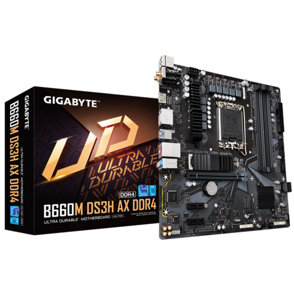
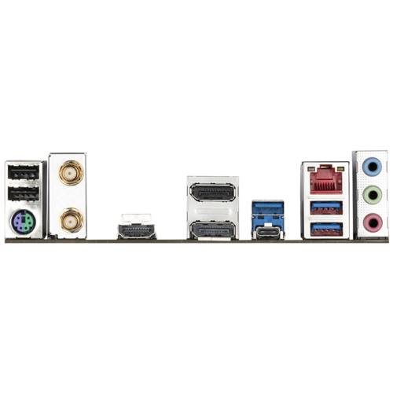

# Hackintosh GIGABYTE B660M DS3H AX DDR4 - i7-12700F



Guide and resources to install macOS on the ***GIGABYTE B660M DS3H AX DDR4*** motherboard with ***Intel i7-12700F*** processor and ***AMD Radeon RX 6900 XT*** GPU.  
Includes real hardware references, dumps, EFI, drivers, and tested configurations.

---

## Index

- [Motherboard Specifications](#motherboard-specifications)
- [Tested Operating Systems and OpenCore](#tested-operating-systems-and-opencore)
- [Hardware and Compatibility Summary](#hardware-and-compatibility-summary)
- [Detected PCI Devices](#detected-pci-devices)
- [Drivers and Downloads](#drivers-and-downloads)
- [Recommended BIOS Configuration](#recommended-bios-configuration)
- [macOS Installation](#macos-installation)
- [Post-installation and EFI](#post-installation-and-efi)
- [Power Management](#power-management)
- [References and Resources](#references-and-resources)

---

## Motherboard Specifications

[Official link](https://www.gigabyte.com/Motherboard/B660M-DS3H-AX-DDR4-rev-1x#kf)

- Supports Intel® Core™ 13th/12th Gen
- 4x DDR4 Dual Channel
- 6+2+1 Hybrid Digital VRM with heatsink
- WIFI 6 802.11ax 2T2R & BT5
- 2.5 GbE LAN
- 2x NVMe PCIe 4.0 x4 M.2
- USB 3.2 Gen 2 TYPE-C®
- High quality audio
- RGB FUSION 2.0
- Smart Fan 6
- Q-Flash Plus BIOS

---

## Tested Operating Systems and OpenCore

- **Ventura 13.6.4 (22G513)**  
  OpenCore: 0.9.9 - SMBIOS: iMacPro1,1
- **Sonoma 14.4.1 (23E224)**  
  OpenCore: 1.0.0 - SMBIOS: iMacPro1,1
- **Sonoma 14.2 (24C101)**  
  OpenCore: 1.0.3 - SMBIOS: iMacPro1,1

> **Note:**  
> - For Ventura, it is recommended to use the native WiFi module (BCM94360Z3).  
> - For Sonoma, you can use BCM94360Z3 only for Bluetooth and an Intel module (e.g., 9560NGW) for WiFi, or apply patches for native WiFi.

---

## Hardware and Compatibility Summary

| Component                | Model / Status                           | macOS Support         |
|--------------------------|------------------------------------------|-----------------------|
| **CPU**                  | Intel i7-12700F (12C/20T)                | Native                |
| **GPU**                  | AMD Radeon RX 6900 XT Merc319            | Native (no kext)      |
| **HDMI Audio**           | AMD Navi 21 HDMI/DP Audio Controller     | Native                |
| **Integrated Audio**     | Intel Alder Lake-S HD Audio Controller   | Native                |
| **Ethernet**             | Realtek RTL8125BG 2.5GbE                 | LucyRTL8125Ethernet   |
| **WiFi/Bluetooth (Ventura)** | BCM94360Z3                         | Native                |
| **WiFi (Sonoma)**        | Intel 9560NGW                            | AirportItlwm          |
| **Original WiFi**        | Mediatek MT7921K (RZ608)                 | Not supported         |
| **USB**                  | Intel XHCI, VIA VL805                    | Native                |
| **NVMe**                 | Silicon Motion SM2263EN/XT               | Native                |
| **SATA**                 | Intel AHCI                               | Native                |
| **ACPI**                 | Full dump available                      | Custom                |

> See [`PCI Info/deviceid-pcis.txt`](PCI%20Info/deviceid-pcis.txt) and [`PCI Info/pcidevices.json`](PCI%20Info/pcidevices.json) for the complete list and technical details of each detected device.

---

## Detected PCI Devices

Example of real PCI devices detected (see reference files for the full list):

- Intel PCI Express Root Port #1/#2/#3
- Intel USB 3.2 Gen2 XHCI Controller
- Intel Shared SRAM
- Intel I2C Controllers (x5)
- Realtek RTL8125 2.5GbE
- AMD Radeon RX 6900 XT
- AMD PCI Express Switch Ports
- VIA USB 3.0 eXtensible Host Controller
- Silicon Motion NVMe
- Intel HD Audio Controller
- RZ608 Wi-Fi 6E (removed)
- Intel Management Engine Interface

---

## Drivers and Downloads

- **Windows Drivers:**  
  - Bluetooth / WiFi (BCM94360Z3, Intel 9560NGW)
- **macOS Drivers:**  
  - LucyRTL8125Ethernet, AirportItlwm, HWSensors, RadeonSensor
- **Tools:**  
  - HWMonitorSMC2, MountEFI, ACPI and GPU ROM dumps

> Folder: `drivers - post install`  
> EFI for Ventura and Sonoma in the `EFI` folder

---

## Recommended BIOS Configuration

**Version F28 (Dec 15, 2023)**

- Platform Power Management: **Enabled**
- Above 4G Decoding: **Enabled**
- VT-d: **Enabled**
- XHCI Hand-off: **Enabled**
- Secure Boot: **Disabled**
- IOAPIC 24-119: **Enabled**
- Legacy USB Support: **Enabled**
- SATA Controllers: **Enabled**
- CFG Lock: **Disabled**
- Fast Boot: **Enabled**
- Initial Display Output: **PCIe 1 Slot**
- Bootup Numlock: **Enabled**

> See the manual and screenshots in the repository for more details and additional settings.

---

## macOS Installation

1. **Create bootable USB**  
   Follow the [Dortania guide](https://dortania.github.io/OpenCore-Install-Guide/installer-guide/).
2. **Configure BIOS**  
   Adjust according to the previous section.
3. **Install macOS**  
   Use the USB and select the corresponding EFI.
4. **Post-installation**  
   Mount the disk's EFI partition and copy the EFI folder from the USB.

---

## Post-installation and EFI

- Use [MountEFI](https://github.com/corpnewt/MountEFI) to mount the EFI partition.
- Copy the `EFI` folder from the USB to the disk's EFI partition.
- Remove the USB and reboot.

---

## Power Management

References:
- [Dortania Power Management](https://dortania.github.io/OpenCore-Post-Install/universal/sleep.html#preparations)
- [pmset man](https://www.dssw.co.uk/reference/pmset/)

**Recommended configuration:**
```shell
sudo pmset autopoweroff 0
sudo pmset powernap 0
sudo pmset standby 0
sudo pmset proximitywake 0
sudo pmset tcpkeepalive 0
sudo pmset hibernatemode 25
```
- **0:** Only sleep, RAM powered (default desktop)
- **3:** Safe sleep (default laptops)
- **25:** Full hibernation, RAM to disk

---

## Backside of Motherboard



---

## Additional Hardware Recommendations

- [PCIe WiFi module holder Xiwai BCM94360CD/CS](https://www.amazon.es/dp/B09BFD4K4R?ref=ppx_pop_mob_ap_share)
- [WiFi Module BCM94360Z3](https://es.aliexpress.com/item/1005003642490910.html)
- [Intel WiFi 9560NGW](https://es.aliexpress.com/item/1005004794565728.html)

---

## References and Resources

- [Dortania Guide](https://dortania.github.io/OpenCore-Install-Guide/)
- [Geekbench CPU](https://browser.geekbench.com/v6/cpu/3586276)
- [Geekbench GPU Metal](https://browser.geekbench.com/v6/compute/1370009)
- [pmset man](https://www.dssw.co.uk/reference/pmset/)
- [DSDT Dump](DSDT%20-%20b660m%20ds3h%20ax)
- [PCI Info/deviceid-pcis.txt](PCI%20Info/deviceid-pcis.txt)
- [PCI Info/pcidevices.json](PCI%20Info/pcidevices.json)

---

## Star History

[](https://www.star-history.com/#klich3/macOS-on-B660M-DS3H-i7-12700F&Date)